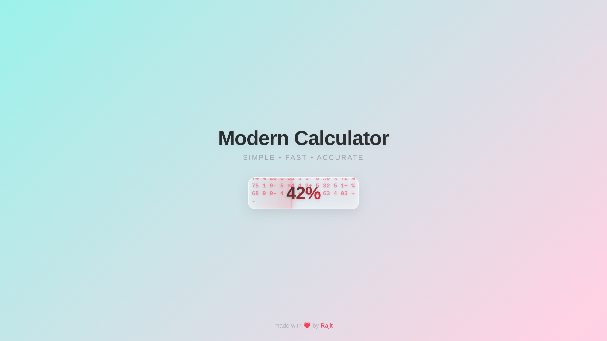
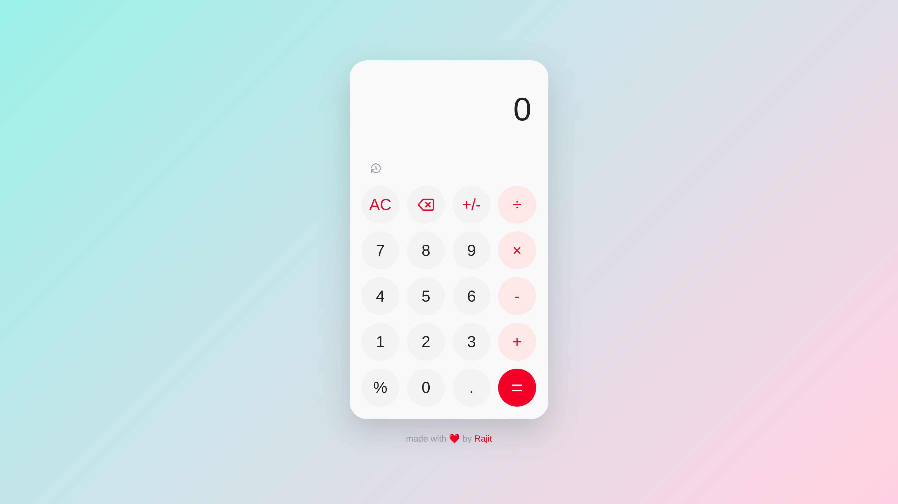
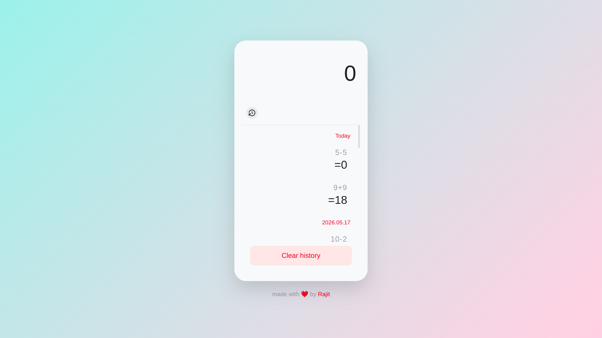

# 🧮 Modern Web Calculator

A sleek, production-ready web calculator built with HTML, CSS, and Vanilla JavaScript. It features a modern gradient UI, smooth animations, persistent local storage history, and full keyboard accessibility.

---

## 🚀 Live Demo
[Click here to view the Live Project](https://rajitcodez.github.io/calculator-app/)

---

## Preview

### Loading Screen


### Calculator app


### History management
  

---

## ✨ Key Features

* **Modern UI/UX:** Clean design using CSS variables, flexbox, and grid layouts with a vibrant gradient background.
* **Smart Preview:** Dynamically evaluates and displays the result of your expression as you type, ignoring trailing operators.
* **Calculation History:** A sliding panel that saves your past calculations locally using `localStorage`. You can click any past result to drop it right back into your current calculation.
* **Keyboard Support:** Fully accessible via keyboard. Type numbers, use operators, press `Enter` to calculate, `Backspace` to delete, and `Escape` to clear.
* **Visual Feedback:** Smooth CSS transitions for button presses and an elegant sliding animation when a calculation is finalized.
* **Clean Architecture:** Fully decoupled codebase (HTML, CSS, JS) utilizing event delegation and modern ES6+ state management. No inline `onclick` handlers!

---

## 🛠️ Technologies Used

* **HTML5:** Semantic structure.
* **CSS3:** Custom properties (variables), Flexbox, CSS Grid, animations, and transitions.
* **JavaScript (ES6+):** Vanilla JS, DOM manipulation, Event Delegation, Local Storage API, and Regex mapping.

---

## 🧠 What I Learned

Building this project was a fantastic deep dive into core frontend web technologies. Here are the key concepts I mastered:

1. **State Management in Vanilla JS:** I learned how to separate my app's data (the current expression, history state, animation locks) from the DOM, making the logic much more predictable.
2. **Event Delegation:** Instead of attaching an `onclick` listener to every single button, I attached a single listener to the keypad container. This taught me how event bubbling works and made the code significantly cleaner.
3. **Local Storage API:** I implemented `localStorage` to save, retrieve, and parse calculation history so that data persists even after the user refreshes or closes the browser tab.
4. **Advanced CSS Animations:** I learned how to combine `@keyframes`, CSS transitions, and JavaScript `setTimeout` functions to choreograph complex animations (like the synchronized splash screen fade-out and calculator fade-in).
5. **Keyboard Accessibility:** I mapped keyboard `keydown` events to specific DOM elements, learning how to prevent default browser behaviors and simulate physical button clicks via code.
6. **Regex (Regular Expressions):** I used Regex to efficiently clean up trailing operators and safely parse mathematical strings before evaluation.

---

## 💻 How to Run Locally

If you want to run this project on your local Linux machine:

1.  **Clone the repository:**
    ```bash
    git clone https://github.com/RajitCodez/calculator-app.git
    ```
2.  **Navigate to the folder:**
    ```bash
    cd calculator-app
    ```
3.  **Open in Browser:**
    * Simply double-click `index.html`.
    * OR, if using VS Code, use the "Live Server" extension.

---

## 🗂️ Folder Structure

```
calculator-app/
├── assets/
│   └── screenshot-calculator-app.png
|   └── screenshot-history-management.png
|   └── screeenshot-loading-screen.png
├── index.html
├── style.css
└── script.js
```

---
# 👤 Author
Made by [Rajit Paul](https://github.com/RajitCodez)
